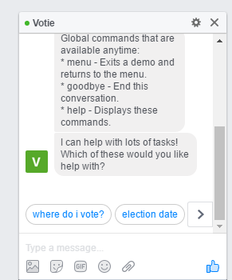
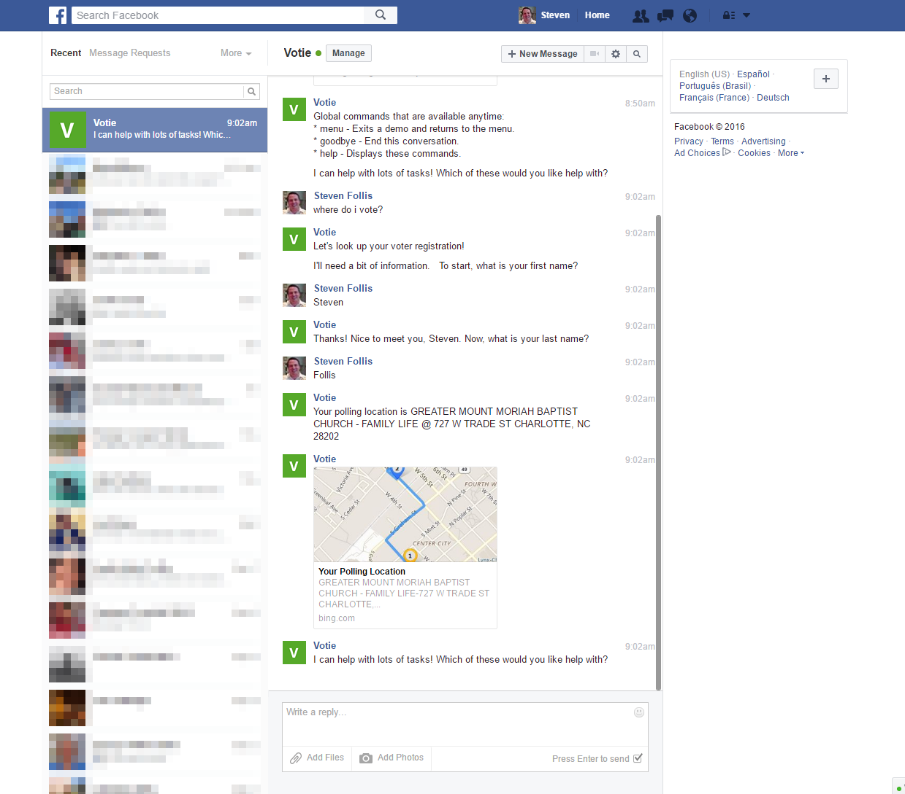

# Votie
A bot that makes voting in easier

## Overview
Locating information about the voting process in America can be difficult. Where to vote, how to register, and voting dates require a user to navigate to a myriad of state websites.  These websites often use forms to lookup and browse through data. 

Votie streamlines this process by using conversation to interact with State data.  A user can chat with Votie who will then retrieve information on the user's behalf. 

Votie is currently implemented with the [Microsoft Bot Framework](https://dev.botframework.com/) with the Facebook Bot channel enabled. Further channels can be enabled without significant rework (SMS, Slack, Telegram, Skype, etc.). 

## Features

* where do i vote? - launches a conversation where Votie asks for a person's first and last names. Votie then queries the [Google Civic Info API](https://developers.google.com/civic-information) website to identify the voting location.  This location is returned to the user as both an address, and as a card that when clicked upon launches a Bing Maps tab centered on the address.  If a name returns multiple users, then a carousel control is used.

* election date - returns the National Election date. TODO: add a .ics file for easy addition to calendars.

* register - returns a hyperlink to Rock the Vote's [registration page](https://www.rockthevote.com/register-to-vote)

## Technical Details
* NodeJS
* Microsoft Bot Framework
* Bing Maps API
* Google Civic Information API

## Screenshot
